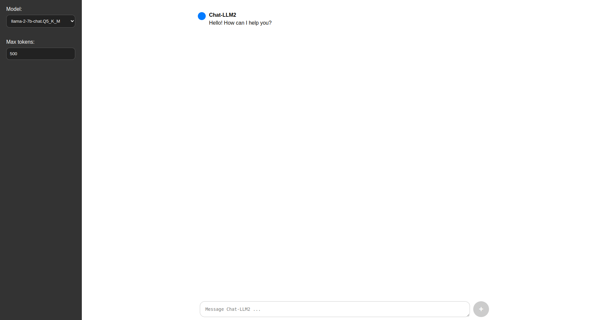
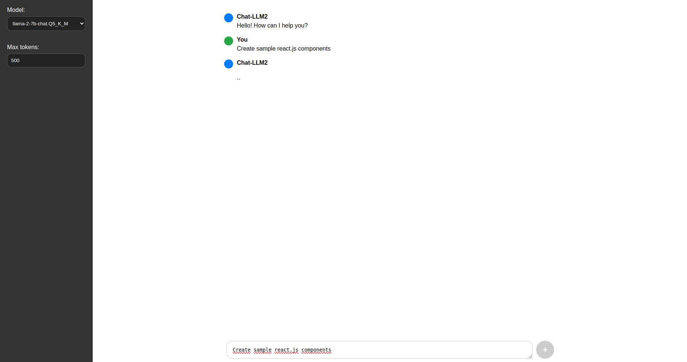
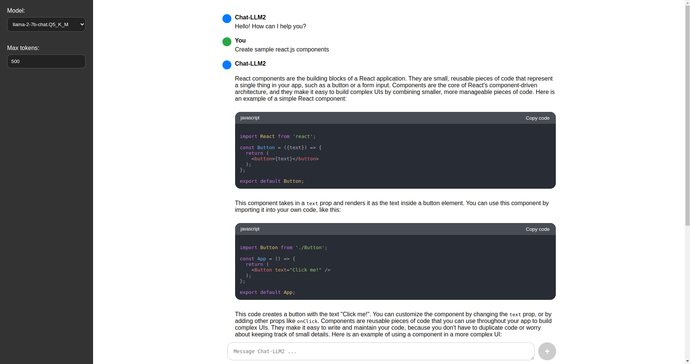

# Project Name

Chat-LLM2

# Project Description

This project is a proof of concept to develop a web application that integrates Llama2 technology using Docker, solely utilizing the CPU. Inspired by the Chat-GPT interface, this application offers an interactive and user-friendly experience. The entire project, including this readme.md, has been generated using GPT-4. Please note that due to its reliance on CPU processing, the application's response time may be slower than usual.

# Images

This section displays various images used in the application, located in the `images` directory.

## Welcome Image


## Thinking Image


## Response Image



## Prerequisites

- Docker

## Installation

Step-by-step instructions to set up the development environment.

### Docker Configuration

The `Dockerfile` establishes a Python environment and exposes port 5000, preparing the system to run the Flask server.

## Model Download

It is essential to download at least one model before starting the server. Execute the following command to download at least one model:

```bash
./tasks.sh download_model
```

## Usage

### Building and Running with Docker

Use the `build` and `run` commands from the `tasks.sh` file to build the docker image and then run it in a container:

```bash
./tasks.sh build
./tasks.sh run
```

### Cleaning Docker Images

To remove unused Docker images:

```bash
./tasks.sh clean
```

## Flask Server and API

`llama2_api.py` sets up a Flask server, loading Llama models from `/models/` and providing API endpoints for interaction.

### API Endpoints

- `GET /api/v1/models/`: Lists available models.
- `POST /api/v1/models/generate`: Generates text using a specific model.

### Web Interface

The application features a web interface accessible at `localhost:5000/`. This interface is similar to that of Chat-GPT, providing a fluid and accessible user experience.

## Contact

For support or collaboration, you can contact me at: dperezcabrera@gmail.com

